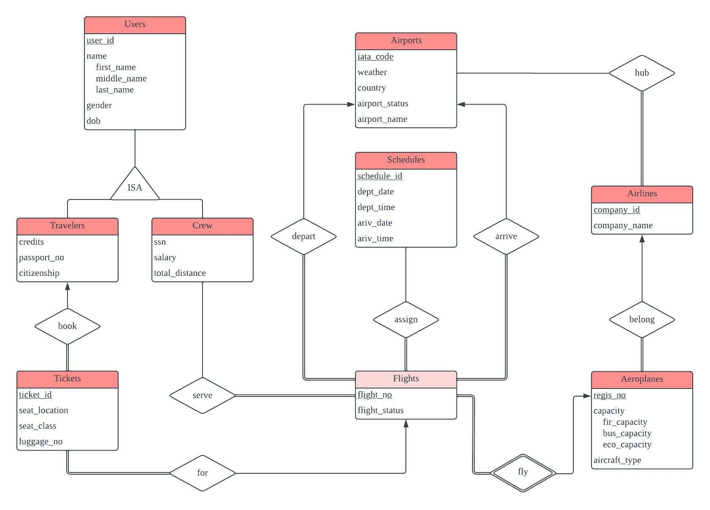

# Background & Introduction

In recent decades, the growing demand for leisure and business travel has led to the prosperity of the airline market. An increasing number of people have been choosing to take flights to travel domestically or internationally. Therefore, an organized and comprehensive database that stores the airline system is critical for both travelers and crew to obtain plenty of simultaneous information.
	
Although there do exist several flight databases or applications for commercial airlines, it is rare to find comprehensive information - including weather at the departure airport and destination, aircraft type, the total flight hours of pilots, and the number of luggage allowed - in just one database. This information offers travelers a chance to be better prepared for traveling.
	
Since our airline querying system contains a relatively extensive data sets, the crew members who choose to use our database are able to access the basic information about the travelers who will be on their flight and provides updates about the airline information. 

# Database High-Level Design

## Assumptions

In order to simulate the real-world situation of a complex flight system, we need to design our database based on the following assumptions. These assumptions can also be used as references for all data constraints.

1. Assume that there have and only have two types of users of the airline querying system: travelers and crew.
		
2. Assume that plane ticket information is stored in the database system and each ticket is only valid for one traveler. However, a traveler may own zero or more plane tickets.
		
3. Assume that each ticket contains a specific seat location for exactly one flight. However, a flight may have multiple tickets being sold to travelers.   
		
4. Assume that a crew member can be either an air attendant or a pilot. Therefore, a crew member can serve zero or more flights. Additionally, a flight must be served by at least one crew member. It does have a slight chance that a small propeller airplane only needs one crew member (i.e. the pilot).
		
5. Assume that a flight is operated by exactly one aeroplane. For example, the aircraft with registration number B-6075 is operating a specific flight (flight number: CA862) from Beijing(PEK) to Geneva(GVA). However, it is likely that one aeroplane can fly multiple flights. Notice that the registration number is unique for each aeroplane.
		
6. Assume that an aeroplane can only belong to one company. Additionally, a airline company can have multiple planes. 
		
7. Assume that each airline company must have at least one airport as its hub, a place where the headquarter of the company locates and where the aeroplanes get maintenance and repaired. However, some large airports can provide services for multiple airline companies. For example, Los Angeles International Airport (LAX) is a hub for both United and Delta Airlines, and Delta Airlines has another hub : Detroit Metropolitan Airport (DTW).
		
8. Assume that each flight can have multiple schedules, and a schedule can be mapped to multiple flights. It is common for most domestic flights to have the same flight flying the same route on two successive days. There is also a slight chance that two flights have the exact same schedule.
		
9. Assume that each flight only departures from exactly one airport and only arrives at exactly one airport. However, an airport can have many flights.

## Entity-Relationship Model

```{r ER-Diagram, echo=FALSE, fig.cap="CSDS341 Airline Database ER-Diagram", out.width = '70%',fig.align="center"}
knitr::opts_chunk$set(fig.pos = "!H", out.extra = "")

```

## Data Description

Our database consists of seven entities, eight relationships, and one identifying relationship. Notice that some tables and relationships are merged together to reduce redundancy.

`Travelers` and `Crew` are considered as users of our airline user system. `Travelers` contains each travelers' information such as `credits`, `citizenship`, etc. `Crew`, sharing part of the attributes with `Travelers`, also has its unique attributes such as `ssn` and `salary`. Note that each user should be either a Traveler or a Crew. A user cannot be both or none, which means that if a `user_id` has already been stored in `Travelers` table, it will not be present in the `Crew` Table. 

For `Travelers`, they are connected to their booking information (i.e. Table `Tickets`) by the `book` relationship, while travelers connect to `flight` information by the `serve` relationship. Note that `flight` cannot exist by itself, which means that a flight must be operated by an aeroplane. Additionally, an aeroplane must belong to exactly one airline company by the `belong` relationship. Moreover, a flight is connected to two airports by the `arrive` and `depart` relationships. An airline company can also connect to `airports` by the `hub` relationship.

Our database implement `NOT NULL` constraints for primary keys and part of other attributes. We also use `FOREIGN KEY` constraints when referencing information from other tables. `PRIMARY KEY` constraints are adopted in all tables to ensure that each tuple is unique. `PRIMARY KEY` constraints also prevent the NULL values being assigned into the table by default. For more information, please see the constraints section where our group listed all primary key constraints, overlap Constraints, Foreign Key Constraints, Mapping Cardinalities, Participation Constraints. 

For Functional Dependencies and Normalization, all of our tables are in BCNF. For each table, the functional dependencies are non-trivial and for each FD $X \rightarrow Y$, X is one of the super key of the table. Since there are no violation of BCNF, no tables should be decomposed from our current design. We will discussed our functional dependencies in more detail later in the Functional Dependencies Section.


# Relational Schema

## Strong Entities

The `Travelers` Table records the information of each traveler such as citizenship and passport numbers.
```
CREATE TABLE IF NOT EXISTS Travelers (
    user_id INT NOT NULL,
    first_name VARCHAR(50),
    middle_name VARCHAR(50),
    last_name VARCHAR(50),
    gender CHAR(1),
    dob DATE,
    credits INT DEFAULT 0,
    passport_no VARCHAR(20),
    citizenship VARCHAR(30),
    PRIMARY KEY (user_id),
    CHECK (gender IN ('M' , 'F', 'U')));
```

The `Crew` Table is built for crew members including pilots. Their information such as social-security number and total distance traveled will be recorded. 
```
CREATE TABLE IF NOT EXISTS Crew (
    user_id INT NOT NULL,
    first_name VARCHAR(50),
    middle_name VARCHAR(50),
    last_name VARCHAR(50),
    gender CHAR(1),
    dob DATE,
    ssn INT NOT NULL,
    salary DOUBLE,
    total_distance INT,
    PRIMARY KEY (user_id),
    CHECK (gender IN ('M' , 'F', 'U')));
```

The `Airports` Table contains information of airports such as the IATA code and name of the airport. 
```
CREATE TABLE IF NOT EXISTS Airports (
    iata_code CHAR(3) NOT NULL,
    airport_name VARCHAR(100), 
    country CHAR(2),
    weather VARCHAR(30),
    airport_status VARCHAR(30),
    PRIMARY KEY (iata_code),
    CHECK (weather IN ('Sunny' , 'Mostly Sunny', 'Partly Cloudy',
        'Cloudy', 'Rainy', 'Heavy Rainy', 'Foggy',
        'Snowy', 'Heavy Snowy', 'Frost')),
    CHECK (airport_status IN ('Free', 'Normal',
        'Busy', 'Small-Scale Delay', 'Large-Scale Delay')));
```

The `Airlines` Table contains information of airline companies. 
```
CREATE TABLE IF NOT EXISTS Airlines (
    company_id INT NOT NULL,
    company_name VARCHAR(50),
    PRIMARY KEY (company_id));
```

The `Schedules` Table contains information of flight schedules including departure time and arrival time. 
```
CREATE TABLE IF NOT EXISTS Schedules (
    schedule_id INT NOT NULL,
    dept_date DATE,
    dept_time TIME,
    ariv_date DATE, 
    ariv_time TIME,
    PRIMARY KEY (schedule_id));
```

## Merged Tables

The `Aeroplanes_belong` Table merges one entity (`Aeroplanes`) and one relationship (`belong`). It contains information about connection between aeroplanes and airline companies.   
```
CREATE TABLE IF NOT EXISTS Aeroplanes_belong (
    regis_no VARCHAR(10) NOT NULL,
    fir_capacity INT,
    bus_capacity INT,
    eco_capacity INT,
    aircraft_type VARCHAR(50),
    company_id INT NOT NULL,
    PRIMARY KEY (regis_no),
    FOREIGN KEY (company_id)
        REFERENCES Airlines(company_id));
```

The `Tickets_book_for` Table merges one entity (`Tickets`) and two relationships (`book` and `for`). It contains traveler booking information. 
```
CREATE TABLE IF NOT EXISTS Tickets_book_for (
    ticket_id INT NOT NULL,
    seat_location CHAR(4),
    seat_class CHAR(1),
    luggage_no INT,
    regis_no VARCHAR(10) NOT NULL,
    flight_no VARCHAR(7) NOT NULL,
    traveler_id INT NOT NULL,
    PRIMARY KEY (ticket_id),
    FOREIGN KEY (traveler_id)
        REFERENCES Travelers(user_id),
	FOREIGN KEY (regis_no, flight_no)
        REFERENCES Flights_ariv_dept(regis_no, flight_no),
    CHECK (seat_class IN ('F' , 'B', 'E')));
```

## Weak Entity

The `Flights_ariv_dept` Table merges one weak entity (`Flights`), one identifying relationship (`Fly`), and two relationships (`arrive`, `depart`). It contains the information of flights as well as its departure and arrival information. 
```
CREATE TABLE IF NOT EXISTS Flights_ariv_dept (
    regis_no VARCHAR(10) NOT NULL,
    flight_no VARCHAR(7) NOT NULL,
    flight_status VARCHAR(10),
    dept_iata_code CHAR(3) NOT NULL,
    ariv_iata_code CHAR(3) NOT NULL,
    PRIMARY KEY (regis_no, flight_no),
    FOREIGN KEY (regis_no)
        REFERENCES Aeroplanes_belong(regis_no),
    FOREIGN KEY (dept_iata_code)
        REFERENCES Airports(iata_code),
    FOREIGN KEY (dept_iata_code)
        REFERENCES Airports(iata_code),
    CHECK (flight_status IN ('On-Time' , 'Delay', 'Cancel')));
```

## Relationships

The `serve` Table contains information of connection between Crew members and the flights they serve. 
```
CREATE TABLE IF NOT EXISTS serve (
    crew_id INT NOT NULL,
    regis_no VARCHAR(10) NOT NULL,
    flight_no VARCHAR(7) NOT NULL,
    PRIMARY KEY (crew_id , regis_no , flight_no),
    FOREIGN KEY (crew_id)
        REFERENCES Crew(user_id),
    FOREIGN KEY (regis_no, flight_no)
        REFERENCES Flights_ariv_dept(regis_no, flight_no));
```

The `assign` Table contains information of connection between flights and flying schedules. 
```
CREATE TABLE IF NOT EXISTS assign (
    regis_no VARCHAR(10) NOT NULL,
    flight_no VARCHAR(7) NOT NULL,
    schedule_id INT NOT NULL,
    PRIMARY KEY (regis_no , flight_no , schedule_id),
    FOREIGN KEY (regis_no, flight_no)
        REFERENCES Flights_ariv_dept(regis_no, flight_no),
    FOREIGN KEY (schedule_id)
        REFERENCES Schedules(schedule_id));
```

The `hub` Table contains information of connectin between airline companies and their hub airports. 
```
CREATE TABLE IF NOT EXISTS hub (
    company_id INT NOT NULL,
    iata_code CHAR(3) NOT NULL,
    PRIMARY KEY (company_id , iata_code),
    FOREIGN KEY (company_id)
        REFERENCES Airlines(company_id),
    FOREIGN KEY (iata_code)
        REFERENCES Airports(iata_code));
```
# Constraints 

## Primary Key Constraints

The Primary Key of each table can either be one or several attributes. Assume that a primary key is NOT NULL and unique. 

1. For Table `Travelers` and `Airports`, the primary key is `user_id`. Since a traveler or a crew `isa` user, a `user_id` cannot be used for a traveler or a crew simultaneously, which will also be discussed in the Overlap Constraints Section. 

2. For Table `Airports`, the primary key is `iata_code`. It stands for the unique three-character International Air Transport Association Code for each airport.

3. For Table `Airlines`, the primary key is `company_id`.

4. For Table `Schedules`, the primary key is `schedule_id`.

5. For Table `Aeroplanes_belong`, the primary key is `regis_no`.

6. For Table `Flights_ariv_dept`, the primary keys are `regis_no` and `flight_no`.

7. For Table `Tickets_book_for`, the primary key is `ticket_id`.

8. For Table `serve`, the primary keys are `crew_id`, `regin_no` and `flight_no`.

9. For Table `assign`, the primary keys are `regis_no`, `flight_no` and `schedule_id`.

10. For Table `hub`, The primary keys are `company_id` and `iata_code`.

## Overlap Constraints

A `User` can be either `Travelers` or `Crew`, but they share the same primary key attribute `user_id`, so a `user_id` cannot be used for a traveler or a crew simultaneously. 

## Foreign Key Constraints

1. The `Tickets_book_for` relation has three foreign-key constraints: 
    * `traveler_id` references the primary key of the `Travelers` relation (`Travelers.user_id`). 
    * `regis_no` references the primary key of the `Flights_ariv_dept` relation (`Flights_ariv_dept.regis_no`).
    * `flight_no` reference the primary key of the `Flights_ariv_dept` relation (`Flights_ariv_dept.flight_no`).
  
2. The `Aeroplanes_belong` relation has one foreign-key constraint: 
    * `company_id` references the primary key of the `Airlines` relation (`Airlines.company_id`).

3. The `Flights_ariv_dept` relation has three foreign-key constraints: 
    * `regis_no` references the primary key of the `Aeroplanes_belong` relation (`Aeroplanes_belong.regis_no`).
    * `dept_iata_code` references the primary key of the `Airports` relation (`Airports.iata_code`). 
    * `ariv_iata_code` references the primary key of the `Airports` relation (`Airports.iata_code`).

4. The `serve` relation has three foreign-key constraints: 
    * `crew_id` references the primary key of the `Crew` relation (`Crew.user_id`). 
    * `regis_no` references the primary key of the `Flights_ariv_dept` relation (`Flights_ariv_dept.regis_no`).
    * `flight_no` reference the primary key of the `Flights_ariv_dept` relation (`Flights_ariv_dept.flight_no`).

5. The `assign` relation has three foreign-key constraints: 
    * `schedule_id` references the primary key of the `Schedules` relation (`Schedules.schedule_id`). 
    * `regis_no` references the primary key of the `Flights_ariv_dept` relation (`Flights_ariv_dept.regis_no`).
    * `flight_no` reference the primary key of the `Flights_ariv_dept` relation (`Flights_ariv_dept.flight_no`).

6. The `hub` relation has three foreign-key constraints: 
    * `company_id` references the primary key of the `Airlines` relation (`Airlines.company_id`). 
    * `iata_code` references the primary key of the `Airports` relation (`Airports.iata_code`).

## Mapping Cardinalities 

1. `book` (merged in relation `Tickets_book_for`) is a many-to-one relationship set from `Tickets` to `Travelers`, meaning that a travelers can book multiple tickets for flights and a ticket can only be used for one traveler. 

2. `for` (merged in relation `Tickets_book_for`) is a many-to-one relationship set from `Tickets` to `Flights`, meaning that a flight can have many tickets being sold and one ticket can only be used for boarding one flight.

3. `serve` is a many-to-many relationship set from `Crew` to `Flights`, meaning that several crews can work on the same flight, and one crew can work on multiple flights.

4. `depart` and `arrive` (merged in relation `Flights_ariv_dept`) are many-to-one relationships from `Flights` to `Airports`, meaning that one airport can have many departing or arriving aeroplanes and one flight can only depart (or arrive) at one airport.

5. `assign` is a many-to-many relationship, meaning that a flight can have several schedules. For instance, a flight can be operated on two successive days. Additionally, for one schedule, there might be two or more flights being operated. 

6. `belong` is a many-to-one relationship set from `Aeroplanes` to `Airlines`, meaning that one airline company can own multiple planes, while a plane can only belong to one airline company. 

7. `hub` is a many-to-many relationship set from `Airlines` to `Airports`, meaning that airline companies can have several hub airports, and one airport can be the hub airport of multiple airlines companies.

## Participation Constraints

1. `Tickets` total participates in `book` and `for`. A ticket must be assigned to one traveler and and must be mapped to a flight. However, a traveler can have no tickets and a flight can have no tickets being sold. 

2. `Flights` total participates in the `depart`, `arrive` and `assign`. This means that a ticket must be assigned to a certain schedule as well as a departure airport and an arrival airport. However, an airport can have no departing or arriving airports, and a schedule can have no flights in that schedule. 

3. `Flights` total participates in `serve`. This means that a flight must be served by at least one crew member, while a crew member can serve zero flights. 

4. `Aeroplanes` total participates in `belong`. This means that an aeroplane must be owned by one airline company and one airline company can own zero aeroplanes. 

5. `Airlines` total participates in `hub`. This means that an airline must have at least one airport as its hub and one airport can have zero or many airlines. 

# Functional Dependencies


# Example Queries


# Implementation


# Roles of members


# What we learned from this project


# GUI Interface

